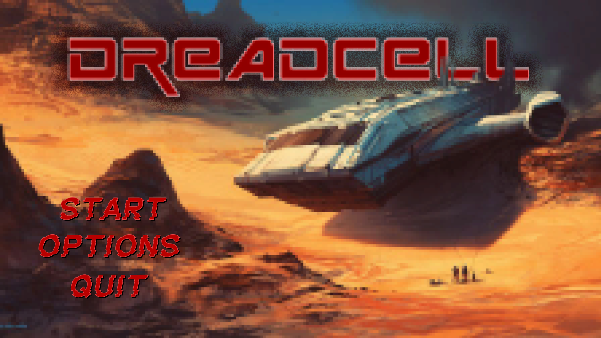
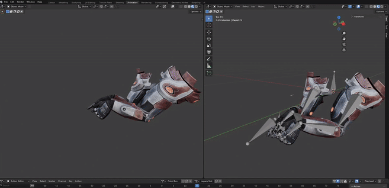
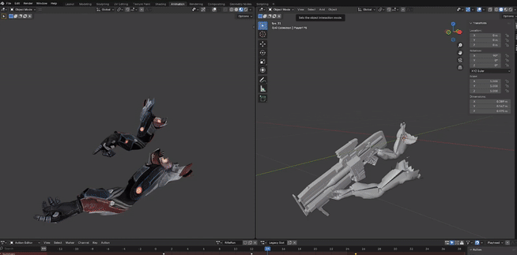

# Liam Hancox - Game Developer Portfolio

### A Game Design & Development Student & Aspiring Game Developer

 

&nbsp;&nbsp;&nbsp;&nbsp;

---

<h1 align="center"> About Me</h1>

   
  

I am a 3rd year mature student studying Computer Games Design and Development at Cardiff Metropolitan University who is passionate about . 

Currently working on refining my skills in **C++**, **C#**, **Unreal Engine** and **Unity**.

*  I’m currently working on:

---

<h1 align="center">Languages and Tools</h1>

<table>
  <tr>
    <th width="33%">
Languages
</th>
    <th width="33%">
Game Engines
</th>
    <th width="33%">
Tools
</th>
  </tr>
  <tr>
    <td align="center" valign="top">
      
       
      
    </td>
    <td align="center" valign="top">
      
       
      
    </td>
    <td align="center" valign="top">
      
       
      
       
      
    </td>
  </tr>
</table>

---

<h1 align="center"> Projects </h1>

# Behind The Lens (2025)

***Behind the Lens*** is a first-person escape room where players solve puzzles by controlling security cameras and remote-controlled devices across multiple rooms. Built in **Unity** as part of a collaborative team project utilising **Git** for version control.

  
  
  <table width="100%">
  <tr>
    <td width="33%" align="center">
      
    </td>
    <td width="33%" align="center">
      
    </td>
    <td width="33%" align="center">
      
    </td>
  </tr>
  </table>

   

<h2 align="center">Contributions</h2>

<table>
  <tr>
    <th width="33%">
        
Security Camera and Monitors System

    </th>
    <th width="33%">
        
UI

    </th>
    <th width="33%">
        
RC-Car Mechanics

    </th>
  </tr>
  <tr>
    <td valign="top">
      <ul>
        <li><b>State-Driven Management:</b> Handling of active/inactive states for multiple camera feeds</li>
        <li><b>Camera Switching:</b> Transition logic between security cameras, devices and player</li>
        <li><b>Faux Live-Feed:</b> Enabling and disabling of camera feeds with capture of last frame to simulate multiple live camera feeds</li>
        <li><b>Interactivity:</b> Raycasts to give the ability to interact with various elements of the game world.</li>
      </ul>
    </td>
    <td valign="top" >
      <ul>
        <li><b>Diegetic Monitors:</b> In world screens dynamically update based on state (Online, Offline and Active)</li>
        <li><b>Contextual HUD:</b> Camera feed information updates to current camera</li>
        <li><b>Dynamic crosshair:</b> Visual feedback when hovering over interactive game objects</li>
      </ul>
    </td>
    <td valign="top">
      <ul>
        <li><b>Physics Based Vehicle Controller:</b> Rigidbody based movement</li>
        <li><b>Possession System:</b> Camera transition and control handover from camera to device</li>
        <li><b>Input Isolation:</b> State-machine logic to prevent input leaking </li>
        <li><b>Asset Creation:</b> Model for RC-Car created in 3DSMax</li>
      </ul>
    </td>
  </tr>
</table>

 

**Engine and Tools :** Unity, GIT

---

 
 
 

# Ant Colony (2025)

***Ant Colony*** is a simulation project exploring emergent behavior, where autonomous agents utilise pheromone trails, A* Pathfinding logic and state-machine logic to gather resources and return them to the nest. Developed solo in **Unity** over a 6-week cycle.

<table width="100%">
  <tr>
    <td width="33%" align="center">
      
    </td>
    <td width="33%" align="center">
      
    </td>
    <td width="33%" align="center">
      
    </td>
  </tr>

  <tr>
    <td width="33%" align="center">
      
    </td>
    <td width="33%">
      </td>
    <td width="33%" align="center">
      
    </td>
  </tr>
</table>

 

<h2>
Contributions
</h2>

<table>
  <tr>
    <th width="33%">
        
AI & Agent Logic

    </th>
    <th width="33%">
        
Pheromone Grid System

    </th>
    <th width="33%">
        
Optimization & Architecture

    </th>
  </tr>
  <tr>
    <td valign="top">
      <ul>
        <li><b>Hierarchical State Machine:</b> Distinct logic for Explorer vs. Worker roles.</li>
        <li><b>Sensory System:</b> "Antennae" raycasts verify pheromone intensity (Left/Right/Forward).</li>
        <li><b>Reactive Mobilization:</b> Nest only spawns Workers after Explorers confirm food location.</li>
        <li><b>Smart Wander:</b> Agents prioritise unexplored grid nodes to maximise efficiency.</li>
      </ul>
    </td>
    <td valign="top" >
      <ul>
        <li><b>Dual-Layer Grid:</b> Separate influence maps for "Food" (Red) and "Exploration" (Blue) trails.</li>
        <li><b>Custom A* Pathfinding:</b> Modified heuristic to weight pheromone trails as "cheaper" paths.</li>
        <li><b>Decay Simulation:</b> Time-based evaporation of trails to prevent loops.</li>
      </ul>
    </td>
    <td valign="top">
      <ul>
        <li><b>Object Pooling:</b> Queue-based system managing 1000+ active agents with auto-expansion.</li>
        <li><b>Polymorphism:</b> Abstract 'Ant' base class handling shared navigation logic.</li>
      </ul>
    </td>
  </tr>
</table>

 

  

**Engine and Tools :** Unity, GIT

 

---

 
 
 

# Dreadcell (2023)

***Dreadcell*** is a 2D top down survival horror shooter and takes place on a crashed terraforming ship taken over by the parasite "Necra-Worm". Inspired by the style of EA's "Dead Space". 

Developed within **Unity** as part of a 4 person team.

  

  <table width="100%">
  <tr>
    <td width="33%" align="center">
      
    </td>
    <td width="33%" align="center">
      
    </td>
    <td width="33%" align="center">
      
    </td>
  </tr>
  </table>

  <h2>
Contributions
</h2>

<table>
  <tr>
    <th width="33%">
        
Player Mechanics

    </th>
    <th width="33%">
        
UI

    </th>
    <th width="33%">
        
Audio

    </th>
  </tr>
  <tr>
    <td valign="top">
      <ul>
        <li><b>Movement:</b> Player movement and aiming mouse and keyboard logic.</li>
        <li><b>Weapon Switching:</b> Weapon switching between the available weapons.</li>
        <li><b>Shooting:</b> Varied shooting logic for each of the weapons.</li>
      </ul>
    </td>
    <td valign="top" >
      <ul>
        <li><b>HUD:</b> Created visual aspects of the players in-game heads up display.</li>
        <li><b>Health bar:</b> Implemented a UI slider linked to the players health, featuring a dynamic colour gradient that changes based on the remaining health percentage.</li>
        <li><b>Experience bar:</b> UI slider and counter that tracks player experience count, along with a Tech point counter for future implementation of a tech tree system.</li>
      </ul>
    </td>
    <td valign="top">
      <ul>
        <li><b>Splash Screen/Main Menu Music:</b> Sourced royalty free music that compliments the visual aesthetic. Implemented audio logic for the Main Menu, including BGM and button sound effects.</li>
        <li><b>In-Game SFX:</b> Sourced all audio for weapons, pick-ups etc and implemented the logic to play them at the appropriate times.</li>
      </ul>
    </td>
  </tr>
</table>

 

  

**Engine and Tools :** Unity, GIT

 
 

## Further Works....

After the initial 2D project, I decided to create a 3D prototype of **Dreadcell**.

For this I created a small test scene and produced my own animations for the First-person view model.

These were created using **Blender**
 
The created animations were :

<table style="width:60%; border:none; margin: 0 auto;">
  <tr>
    <td style="vertical-align: top; width: 50%;">
      <strong>Pistol Equipped</strong>
      <ul>
      <li>Idle Animation</li>
        <li>Walk Animation</li>
        <li>Run Animation</li>
        <li>Equip Animation</li>
        <li>Un-Equip Animation</li>
      </ul>
    </td>
    <td style="vertical-align: top; width: 50%;">
      <strong>Rifle Equipped</strong>
      <ul>
        <li>Idle Animation</li>
        <li>Walk Animation</li>
        <li>Run Animation</li>
        <li>Equip Animation</li>
        <li>Un-Equip Animation</li>
      </ul>
    </td>
  </tr>
</table>

 

<table width="100%">
  <tr>
    <td width="33%" align="center">
      
    </td>
    <td width="33%">
      
    </td>
    <td width="33%" align="center">
      
    </td>
  </tr>
</table>

 

**Engine and Tools :** Unity, Blender and GIT

 

<h1 align="center"> Game Jam's (GGJ's) </h1>

# Bubbletro (2025)

 
 
 
 

## 📫 Connect with me
* **Email:** [liam.hancox1992@gmail.com](mailto:liam.hancox1992@gmail.com)
* **LinkedIn:** [linkedin.com/in/yourname](https://linkedin.com/in/yourname)
